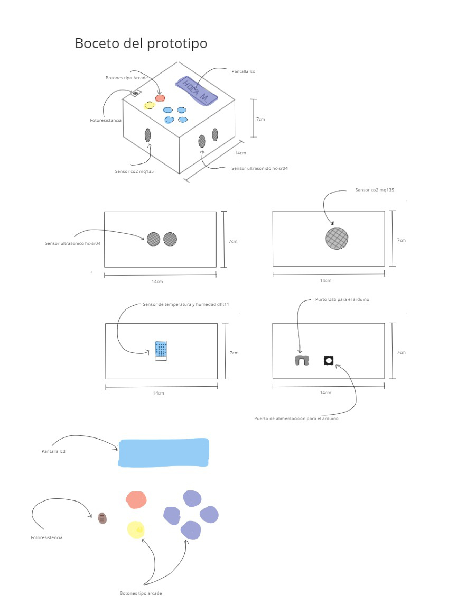
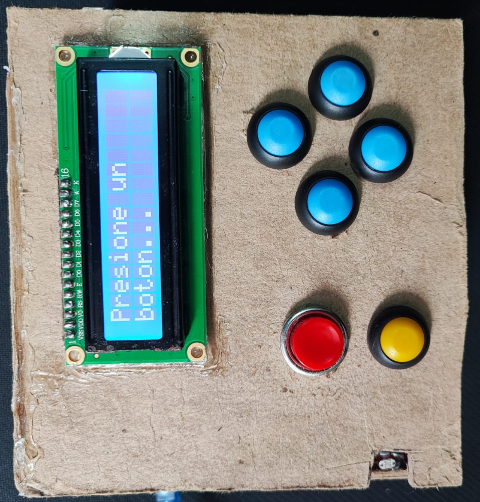
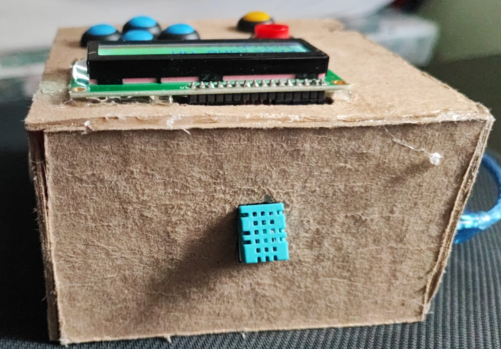
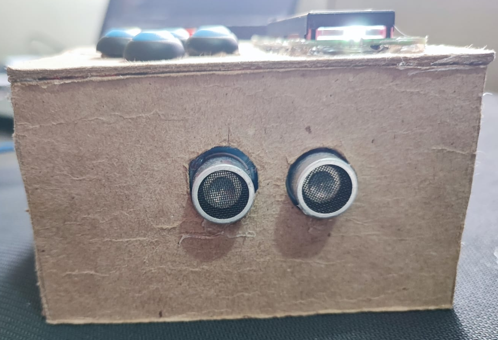
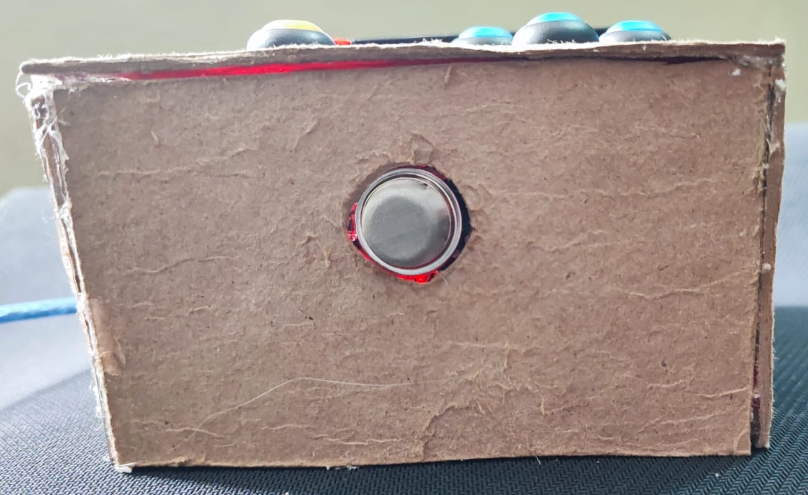
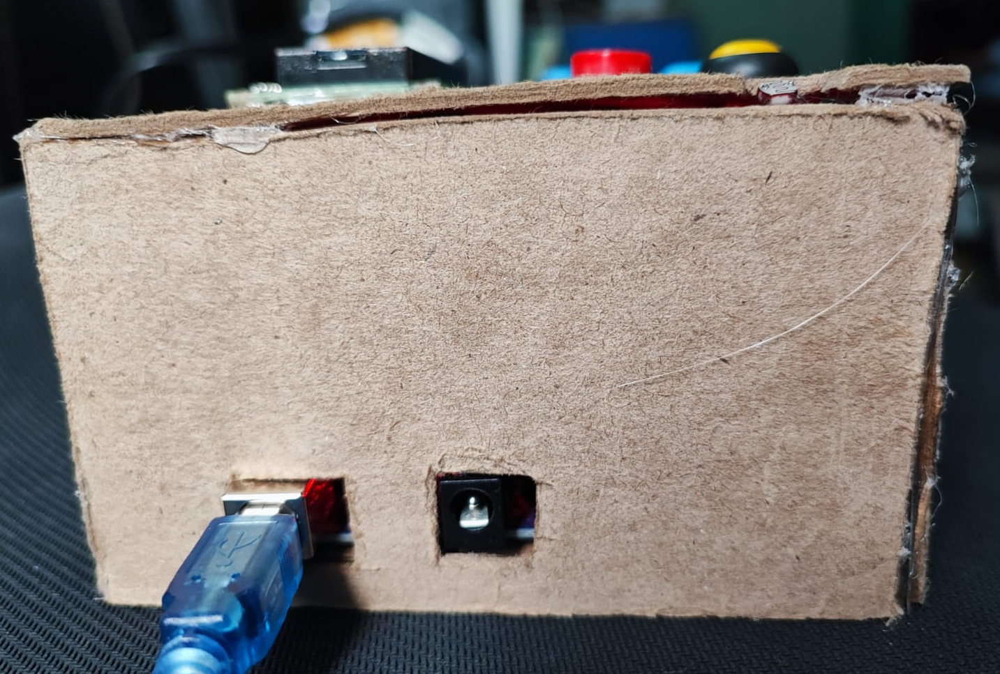
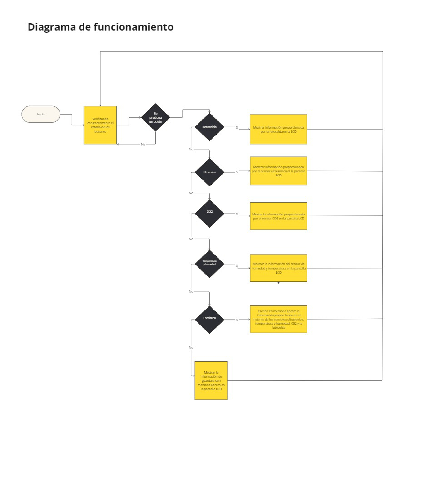

# MANUAL TÉCNICO FASE 1 - PROYECTO 1

### INTEGRANTES GRUPO NO. 04

| Nombre                                | Carné     
|---------------------------------------|-----------
| Douglas Darío Rivera OJeda            | 201122881
| Christian Alessander Blanco González  | 202000173
| Steven Josue González Monroy          | 201903974
| Carlos Raúl Rangel Robelo             | 9112246

## Control del Ambiente en Dormitorios Inteligentes Implementando Análisis Meteorológico IoT

### Funcionamiento
El proyecto se enfoca en el desarrollo de una estación meteorológica IoT para dormitorios inteligentes. Utiliza sensores para recabar datos climáticos en tiempo real y los envía a una plataforma centralizada. Los usuarios pueden visualizar estos datos a través de una aplicación web.

### Usos
- *Monitoreo Climático:* Permite el seguimiento en tiempo real de condiciones climáticas en la habitación.
- *Análisis de Datos:* Analiza la información recopilada para predecir patrones climáticos.
- *Gestión de Dispositivos:* Controla dispositivos IoT en el dormitorio mediante una plataforma central.

### Beneficios
- *Condiciones Saludables:* Asegura un ambiente óptimo controlando temperatura, humedad y calidad del aire.
- *Eficiencia Energética:* Mejora el uso de energía basándose en el análisis de datos climáticos.
- *Experiencia de Usuario Intuitiva:* Ofrece una plataforma fácil de usar para la interacción con el entorno doméstico inteligente.

### Impacto Ambiental
Promueve la sostenibilidad mediante la reducción del consumo energético y el monitoreo de la calidad del aire, contribuyendo a un menor impacto ambiental.

## BOCETOS DEL PROTOTIPO

El boceto muestra un cubo con los siguientes componentes:

- Pantalla LCD de 16x2 pulgadas en la cara frontal. 

- Sensor de temperatura DHT11 en la cara lateral izquierda.

- Sensor de humedad DHT11 en la cara lateral derecha.

- Sensor de movimiento HC-SR04 en la cara superior.

- Modulo foto celda en la cara principal del prototipo.

- Placa Arduino MEGA generico en la base con los siguientes puertos:

    - Puerto de alimentación

    - Puerto USB

    - Puertos digitales y analógicos 

Se incluyen los siguientes detalles adicionales:

- Cables conectando los sensores a los puertos digitales del Arduino.

- Puntos de montaje de los sensores en las caras del cubo. 

- Leyenda identificando cada componente.

- Descripción del funcionamiento de cada sensor:

    - El DHT11 mide temperatura y humedad.

    - El HC-SR04 detecta movimiento de objetos.

Este boceto proporciona una representación más completa del prototipo, mostrando la ubicación y conexiones de los componentes. Los detalles técnicos específicos pueden variar en la implementación final.



## PROTOTIPO PROPUESTO











## DESCRIPCIÓN DE LAS CAPAS SMART CONNECTED DESIGN FRAMEWORK

Para esta fase se utilizaron unicamente 2 capas del Smart Connected Design Framework, las cuales son las siguientes:

### Hardware:
1. Microcontrolador:
 * Arduino Mega

 2. Sensores:
    
    * Ultrasonico HC-SR04

    * Humedad y Temperatura DHT11

    * CO2 MQ-135

    * Modulo de fotocelda

3. Actuadores:

* Pantalla LCD 16x22

* 6 botones

### Software:

1. SO / Plataforma:

2. Arduino

3. Código de compilación para los sensores:

    ## Explicación del Código

    El código proporcionado es un programa para el dispositivo que utiliza diversos sensores (fotocelda, sensor de proximidad ultrasónico, sensor de temperatura y humedad DHT11, y un sensor de gas MQ135) y un display LCD para mostrar diferentes tipos de información ambiental, como luminosidad, calidad del aire, temperatura, humedad y detección de movimiento.

    ### Librerías Utilizadas

    - **LiquidCrystal.h**: Esta librería permite controlar pantallas LCD de caracteres.
    - **EEPROM.h**: Proporciona funciones para acceder a la memoria EEPROM del microcontrolador, que permite almacenar datos de forma no volátil.
    - **DHT.h**: Librería para interactuar con el sensor de temperatura y humedad DHT.

        ```C++
        #include <LiquidCrystal.h>
        #include <EEPROM.h>
        #include <DHT.h>
        ```

    ### Variables Globales y Definiciones

    - **Constantes y pines definidos**: Se definen constantes para los pines utilizados para los diferentes sensores y botones.
    - **enum Estado**: Define un conjunto de estados posibles del sistema.
    - **Variables globales**: Incluyen objetos para controlar los sensores DHT y LCD, y variables para controlar el estado y la lectura de la fotocelda.

        ```C++
        LiquidCrystal lcd(46, 47, 48, 49, 50, 51);
        #define Echo 5
        #define Trigger 6

        #define analogMq135 A0

        #define analogFotocelda A1

        #define DHT_TYPE DHT11
        #define DHT_PIN 7

        #define EEPROM_START_TEMPERATURA 0
        #define EEPROM_START_HUMEDAD 10
        #define EEPROM_START_LUZ 20
        #define EEPROM_START_CO2 30
        #define EEPROM_START_PROXIMIDAD 40

        enum Estado {
            NINGUNO,
            FOTOCELDA,
            MOSTRARINFO
        };

        Estado ESTADO;

        DHT dht(DHT_PIN, DHT_TYPE);

        const int boton1 = 2;
        const int boton2 = 3;
        const int boton3 = 18;
        const int boton4 = 19;

        const int boton5 = 20;
        const int boton6 = 17;

        // Definimos la sensibilidad de la fotocelda
        const float sensibilidadFotocelda = 100.0;  // V/lux

        // Definimos el factor de corrección
        const float factorCorreccion = 1.0;

        // Definimos el área sensible a la luz de la fotocelda
        const float areaFotocelda = 1.0;  // cm^2

        bool puedeLeerFotocelda = true;
        long unsigned tiempoFotocelda = 0;
        int tiempoEsperaFotocelda = 4000;

        const long A = 1000;  //Resistencia en oscuridad en KΩ
        const int B = 15;     //Resistencia a la luz (10 Lux) en KΩ
        const int Rc = 10;    //Resistencia calibracion en KΩ
        ```
    ### Función setup()

    - **Inicialización**: Se inicializan los pines, se configura la comunicación serial, se adjuntan las interrupciones para los botones, se inicia el LCD y el sensor DHT, y se muestra un mensaje de bienvenida en el LCD.

        ```C++
        void setup() {
        Serial.begin(9600);          //iniciailzamos la comunicación
        pinMode(Trigger, OUTPUT);    //pin como salida
        pinMode(Echo, INPUT);        //pin como entrada
        digitalWrite(Trigger, LOW);  //Inicializamos el pin con 0

        pinMode(boton1, INPUT_PULLUP);  //pin como entrada
        pinMode(boton2, INPUT_PULLUP);  //pin como entrada
        pinMode(boton3, INPUT_PULLUP);  //pin como entrada
        pinMode(boton4, INPUT_PULLUP);  //pin como entrada
        pinMode(boton5, INPUT_PULLUP);  //pin como entrada
        pinMode(boton6, INPUT_PULLUP);  //pin como entrada

        attachInterrupt(digitalPinToInterrupt(boton2), fun2, FALLING);
        attachInterrupt(digitalPinToInterrupt(boton3), fun3, FALLING);

        lcd.begin(16, 2);
        lcd.clear();

        dht.begin();

        writeLine(0, "Welcome");  //mensaje de inicio
        writeLine(1, "Developed by G04");
        delay(3000);
        clearLine(0);
        clearLine(1);
        ESTADO = NINGUNO;
        }
        ```

    ### Función loop()

    - **Ciclo Principal**: En función del estado actual, se ejecutan diferentes tareas. Si no hay un estado específico, se espera que se presione un botón. Si el estado es FOTOCELDA, se obtiene y muestra la lectura de la fotocelda. Si es MOSTRARINFO, se muestran los datos almacenados en la EEPROM.

        ```c++
        void loop() {
        // put your main code here, to run repeatedly:
            if (ESTADO == NINGUNO) {
                verificarBotones();
                lcd.setCursor(0, 0);
                lcd.print("Presione un");
                lcd.setCursor(0, 1);
                lcd.print("boton...");
            } else if (ESTADO == FOTOCELDA) {
                fotocelda();
            } else if (ESTADO == MOSTRARINFO){
                mostrarDatosEEPROM();
            }
        }
        ```

    ### Otras Funciones

    - **Funciones asociadas a los botones**: Cada botón tiene una función asociada que se activa cuando se presiona.
    - **Funciones de lectura de sensores**:
        - `fotocelda()`: Obtiene y muestra la lectura de la fotocelda.
        - `getLumens()`: Calcula la luminosidad en lux a partir de la lectura analógica de la fotocelda.
        - `getMovimiento()`: Utiliza el sensor de proximidad ultrasónico para detectar movimiento.
        - `getPartPerMillon()`: Calcula la concentración de CO2 en partes por millón (PPM) utilizando el sensor de gas MQ135.
    - **Funciones de manipulación del LCD**:
        - `writeLine()`: Escribe un mensaje en una línea específica del LCD.
        - `clearLine()`: Borra una línea específica del LCD.

    ### Funciones de Almacenamiento y Lectura EEPROM

    - `guardarDatos()`: Guarda los datos actuales de los sensores en la EEPROM.
    - `mostrarDatosEEPROM()`: Lee y muestra los datos almacenados previamente en la EEPROM.

    ### Consideraciones Importantes

    - El código utiliza interrupciones para detectar cuando se presionan los botones, lo que permite una respuesta rápida a las acciones del usuario.
    - Se utiliza la memoria EEPROM para almacenar datos relevantes, lo que permite conservar información incluso después de apagar el dispositivo.

## DIAGRAMA DE FLUJO

