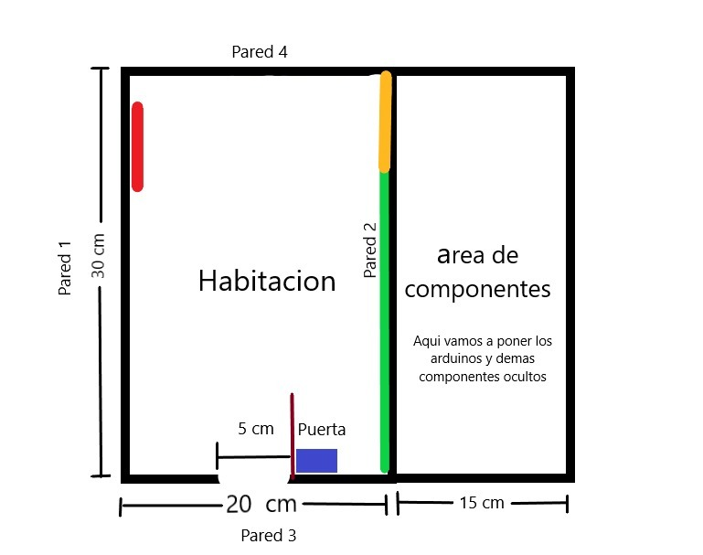
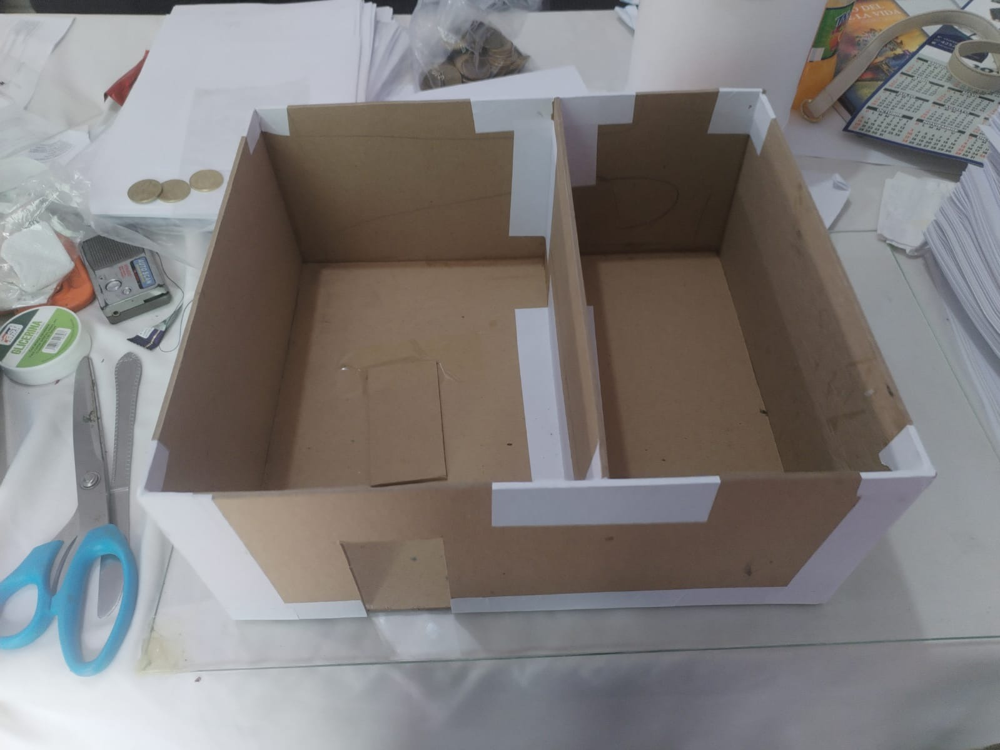
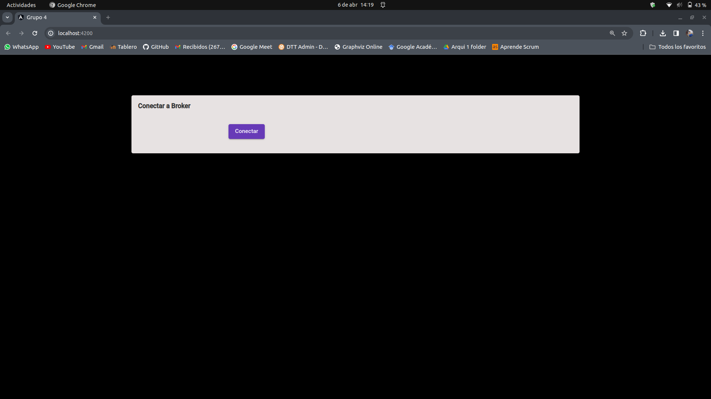
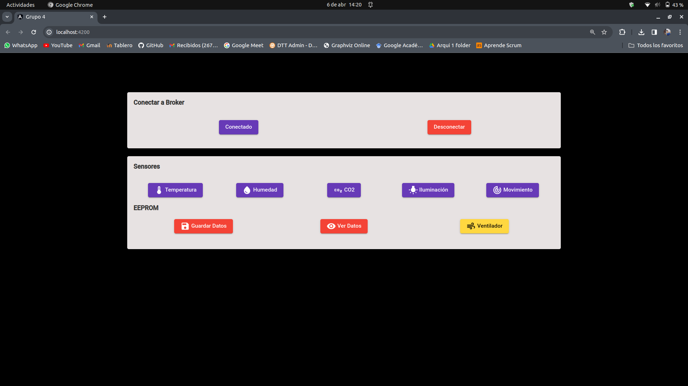
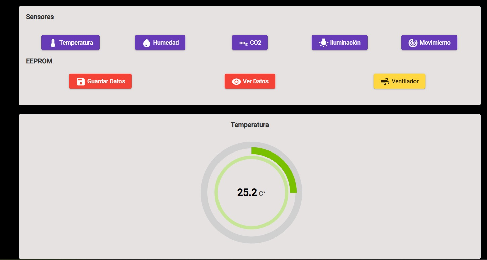
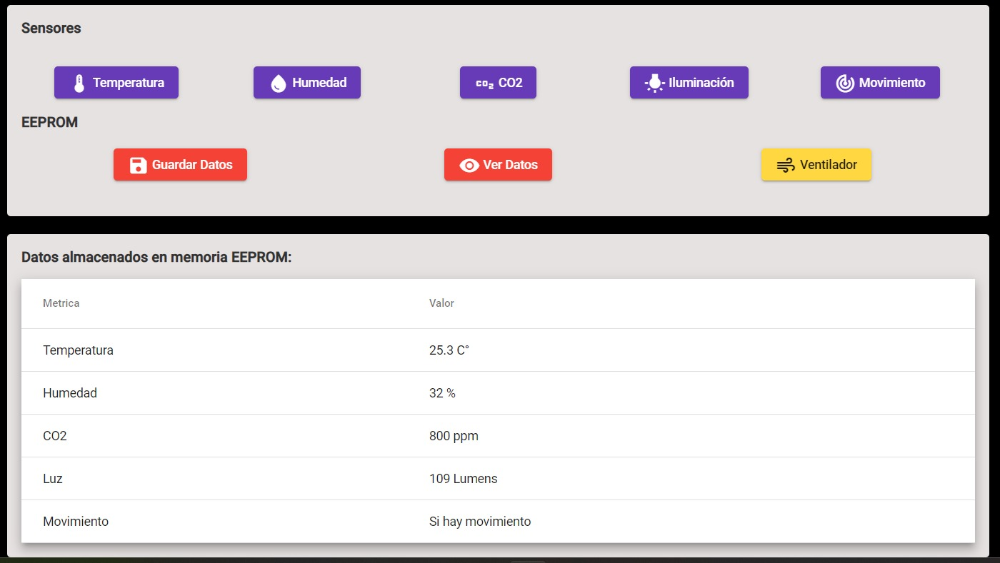
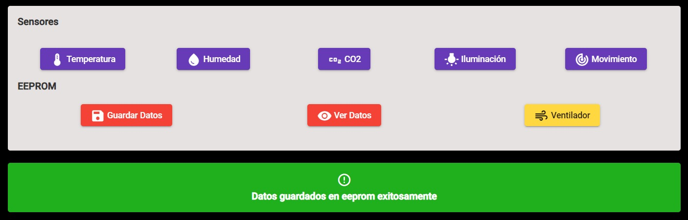
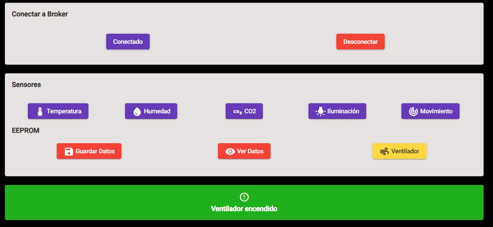
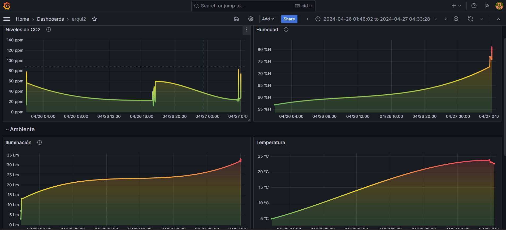

# MANUAL TÉCNICO FASE 3 - PROYECTO

### INTEGRANTES GRUPO NO. 04

| Nombre                                | Carné     
|---------------------------------------|-----------
| Douglas Darío Rivera OJeda            | 201122881
| Christian Alessander Blanco González  | 202000173
| Steven Josue González Monroy          | 201903974
| Carlos Raúl Rangel Robelo             | 9112246

## Control del Ambiente en Dormitorios Inteligentes Implementando Análisis Meteorológico IoT

### Funcionamiento
El proyecto se enfoca en el desarrollo de una solución IoT para dormitorios inteligentes. Utiliza sensores para recabar datos climáticos en tiempo real y los envía a una plataforma centralizada. Los usuarios pueden visualizar estos datos a través de una aplicación web.

### Usos
- *Monitoreo Climático:* Permite el seguimiento en tiempo real de condiciones climáticas en la habitación.
- *Análisis de Datos:* Analiza la información recopilada para predecir patrones climáticos.
- *Gestión de Dispositivos:* Controla dispositivos IoT en el dormitorio mediante una plataforma central.

### Beneficios
- *Condiciones Saludables:* Asegura un ambiente óptimo controlando temperatura, humedad y calidad del aire.
- *Eficiencia Energética:* Mejora el uso de energía basándose en el análisis de datos climáticos.
- *Experiencia de Usuario Intuitiva:* Ofrece una plataforma fácil de usar para la interacción con el entorno doméstico inteligente.

### Impacto Ambiental
Promueve la sostenibilidad mediante la reducción del consumo energético y el monitoreo de la calidad del aire, contribuyendo a un menor impacto ambiental.

## DESCRIPCIÓN DE LAS CAPAS SMART CONNECTED DESIGN FRAMEWORK

Para esta fase se utilizaron las 5 capas del Smart Connected Design Framework, las cuales son las siguientes:

### Hardware:
1. Microcontrolador:
 * Arduino Mega

 2. Sensores:
    
    * Ultrasonico HC-SR04

    * Humedad y Temperatura DHT11

    * CO2 MQ-135

    * Modulo de fotocelda

3. Actuadores:

* Ventilador

* EEPROM

* Relé

### Software:

1. SO / Plataforma:

2. Arduino

3. Linux AWS

4. Broker EMQX

### Communication

1. Modulo WIFI ESP-32

2. Protocolo MQTT

### Cloud Plataform

1. Broker MQTT
2. Base de datos en mysql, RDS amazon
3. Grafana en instancia ec2 amazon

### Cloud Application

1. Frontend en Angular en S3

## SENSORES

### SENSOR MQ135

1. `float getPartPerMillon()`: Esta línea define una función llamada `getPartPerMillon` que devuelve un valor de tipo `float` (número decimal). No recibe ningún argumento.

2. `int val = analogRead(analogMq135);`: Aquí se lee el valor analógico del pin `analogMq135` (que probablemente está definido previamente en el código) utilizando la función `analogRead`. Este valor analógico representa la lectura del sensor MQ135, que está conectado a ese pin. El valor se almacena en la variable `val` como un número entero (`int`).

3. Declaraciones de constantes:
   - `float A = 116.6020682;`: Se define la constante `A` como un valor decimal.
   - `float B = -2.769034857;`: Se define la constante `B` como otro valor decimal.

4. `float R0 = 76.63;`: Aquí se define otra constante llamada `R0`, que representa la resistencia en el aire limpio.

5. `float Rs = (1023.0 / val) - 1.0;`: Se calcula la resistencia del sensor (`Rs`) utilizando la fórmula (1023 / valorLeído) - 1. Esto es común en la lectura de sensores analógicos en Arduino, donde 1023 es el valor máximo de lectura analógica (cuando el pin está a 5V).

6. `float ppm = A * pow(Rs / R0, B);`: Se calcula la concentración de CO2 en PPM utilizando la fórmula proporcionada. Se eleva `Rs / R0` a la potencia `B` utilizando la función `pow` (potencia). Esto es una conversión de la resistencia del sensor a una concentración de CO2 en PPM utilizando una fórmula específica calibrada para el sensor MQ135.

7. `return ppm;`: Finalmente, la función devuelve el valor calculado de PPM, que representa la concentración de CO2 detectada por el sensor en el ambiente.

### SENSOR FOTOCELDA

1. `float getLumens()`: Esta línea define una función llamada `getLumens` que devuelve un valor de tipo `float` (número decimal). No recibe ningún argumento.

2. `int V = analogRead(analogFotocelda);`: Aquí se lee el valor analógico del pin `analogFotocelda` (que probablemente está definido previamente en el código) utilizando la función `analogRead`. Este valor analógico representa la lectura de una fotocelda o sensor de luz, que está conectado a ese pin. El valor se almacena en la variable `V` como un número entero (`int`).

3. Declaraciones de constantes (asumo que estas constantes están definidas en otra parte del código):
   - `long A`: Presumiblemente, esta constante `A` está definida como un valor decimal.
   - `long B`: Presumiblemente, esta constante `B` está definida como otro valor decimal.
   - `long Rc`: Presumiblemente, esta constante `Rc` está definida como otro valor decimal.

4. `return ((long)(1024 - V) * A * 10) / ((long)B * Rc * V);`: En esta línea, se calculan los lúmenes (unidad de medida de luminosidad) basándose en la lectura del sensor de luz. Aquí está el desglose del cálculo:
   - `1024 - V`: Calcula la diferencia entre el valor máximo posible (1024, cuando el pin está a 5V) y el valor leído `V`. Esto se hace para invertir la lectura y obtener una relación proporcional inversa con la luz (mayor luz, menor valor).
   - `((long)(1024 - V) * A * 10)`: Multiplica la diferencia calculada por la constante `A` y por 10. Esto ajusta la escala de los lúmenes calculados.
   - `/ ((long)B * Rc * V)`: Divide el resultado anterior entre el producto de las constantes `B`, `Rc`, y el valor leído `V`. Esto completa el cálculo de los lúmenes.

### SENSOR HC-SR04

1. `bool getMovimiento()`: Esta línea define una función llamada `getMovimiento` que devuelve un valor booleano (`true` o `false`). No recibe ningún argumento.

2. Declaración de variables:
   - `long t;`: Se declara una variable `t` para almacenar el tiempo que tarda en llegar el eco del ultrasonido.
   - `long d;`: Se declara una variable `d` para almacenar la distancia en centímetros calculada a partir del tiempo de eco.

3. Inicio del proceso de medición:
   - `digitalWrite(Trigger, HIGH);`: Se establece el pin `Trigger` (presumiblemente el pin de control del sensor de ultrasonido) en estado alto para enviar un pulso.
   - `delayMicroseconds(10);`: Se espera un breve tiempo de 10 microsegundos para enviar el pulso.
   - `digitalWrite(Trigger, LOW);`: Se vuelve a poner el pin `Trigger` en estado bajo para detener el pulso.

4. Medición del tiempo de eco:
   - `t = pulseIn(Echo, HIGH);`: Se utiliza la función `pulseIn` para medir la duración del pulso de eco en el pin `Echo` cuando está en estado alto. Esto devuelve el tiempo que tarda en llegar el eco, que se almacena en la variable `t`.

5. Conversión de tiempo a distancia:
   - `d = t / 59;`: Se escala el tiempo medido (`t`) dividiéndolo por 59 para obtener la distancia en centímetros. Esta conversión asume que la velocidad del sonido es de aproximadamente 343 metros por segundo, lo que equivale a 0.0343 centímetros por microsegundo (34300 cm/s).

6. Condición de detección de movimiento:
   - `if(d<100){ return true; }`: Si la distancia medida (`d`) es menor que 100 centímetros, la función devuelve `true`, lo que indica que se ha detectado movimiento.
   - `return false;`: Si la distancia medida es igual o mayor que 100 centímetros, la función devuelve `false`, indicando que no se ha detectado movimiento.

### SENSOR DHT11

1. `float getTemperature()`: Esta función devuelve un valor decimal (`float`) que representa la temperatura medida por el sensor DHT.

   - `dht.readTemperature()`: Esta parte del código utiliza la función `readTemperature()` del objeto `dht` para obtener la lectura de temperatura del sensor. La función devuelve la temperatura en grados Celsius como un valor decimal (`float`).

2. `float getHumidity()`: Esta función devuelve un valor decimal (`float`) que representa la humedad medida por el sensor DHT.

   - `dht.readHumidity()`: Similar a la función `readTemperature()`, esta línea utiliza la función `readHumidity()` del objeto `dht` para obtener la lectura de humedad del sensor. La función devuelve la humedad relativa en porcentaje como un valor decimal (`float`).

Para que este código funcione correctamente, debes asegurarte de que:

- Has incluido la biblioteca DHT en tu proyecto Arduino utilizando una declaración `#include <DHT.h>` al comienzo de tu código.
- Has creado un objeto DHT con la configuración adecuada, como el pin al que está conectado el sensor y el tipo de sensor (DHT11, DHT22, etc.), por ejemplo: `DHT dht(DHTPIN, DHTTYPE);`.
- Has inicializado el sensor en el `setup()` de tu código, por ejemplo: `dht.begin();`.

## CODIGO ARDUINO

1. **Función de Callback `callback`**:
   - Esta función se llama cada vez que el cliente MQTT recibe un mensaje en un topic al que está suscrito.
   - `void callback(char *topic, byte *payload, unsigned int length)`: Esta función toma tres parámetros: el nombre del topic (`topic`), el contenido del mensaje (`payload`), y la longitud del mensaje (`length`).
   - El código dentro de la función imprime el mensaje recibido en la consola serial, analiza el contenido del mensaje y realiza diferentes acciones según el mensaje recibido.
   - Por ejemplo, si el mensaje es "1", llama a la función `sendDataTemp()` para enviar datos de temperatura, y así sucesivamente para otros mensajes como "2", "3", etc., realizando acciones como enviar datos de humedad, CO2, luz, movimiento, etc.

2. **Función `reconnectClient`**:
   - Esta función se encarga de intentar reconectar al cliente MQTT al servidor si la conexión se pierde.
   - Utiliza un bucle `while` para intentar la reconexión mientras el cliente no esté conectado.
   - Dentro del bucle, intenta conectar el cliente al servidor MQTT utilizando un `clientId` y publica un mensaje en el topic "g4outTopic" si la conexión es exitosa.

3. **Funciones `setup` y `loop`**:
   - `setup()`: Se ejecuta una vez al iniciar el programa. Inicializa la comunicación serial, configura los pines del Arduino, establece la conexión al servidor MQTT, configura la función de callback `callback`, inicia la conexión WiFi y otras inicializaciones necesarias.
   - `loop()`: Se ejecuta de forma continua en un bucle. Verifica el estado de la conexión WiFi y la conexión del cliente MQTT, llama a `reconnectWifi()` y `reconnectClient()` si es necesario, y ejecuta el bucle de MQTT (`client.loop()`) para mantener la comunicación con el servidor MQTT.
   - También verifica si hay datos disponibles en la entrada serial (`Serial.available()`), lee los datos y realiza acciones según el comando recibido, como enviar datos de sensores, guardar datos, cambiar el estado del motor, etc.

## SUSCRIPTOR

### SUSCRIPTOR

1. **Importaciones de módulos**:

   - `import paho.mqtt.client as mqtt`: Importa el cliente MQTT del módulo `paho.mqtt.client`.
   - `import pymysql`: Importa la libreria para poder conectarse e insertar datos en la base de datos.
   - `import json`: Importa la libreria que permite la manipulación de objetos JSON.

2. **Creación de la conexión a la base de datos**:
   - `conn = pymysql.connect(host=db_host, user=db_user, password=db_password, db=db_name)`: Crea un objeto para la conección de la    base de datos utilizando las credenciales de la misma.
   - `cur = conn.cursor()`: permite insertar data en la base de datos.

3. **Funciones de callback**:
   - `on_connect(client, userdata, flags, rc)`: Esta función se llama cuando el cliente MQTT se conecta al servidor. En este caso, simplemente imprime un mensaje de conexión exitosa y suscribe al cliente al topic designado para casa sensor.
   - `on_message(client, userdata, msg)`: Esta función se ejecuta cuando el cliente recibe un mensaje del servidor MQTT en el topic al que está suscrito. Imprime el mensaje recibido y lo envía a través de la conexión serial.

4. **Creación del cliente MQTT**:
   - `client = mqtt.Client()`: Crea una instancia del cliente MQTT.

5. **Configuración de callbacks**:
   - `client.on_connect = on_connect`: Configura la función `on_connect` como el callback para cuando el cliente se conecta al servidor MQTT.
   - `client.on_message = on_message`: Configura la función `on_message` como el callback para cuando el cliente recibe un mensaje del servidor MQTT.

6. **Conexión al servidor MQTT**:
   - `client.connect("broker.emqx.io", 1883, 60)`: Conecta el cliente al servidor MQTT en la dirección "broker.emqx.io" y el puerto 1883 con un tiempo de espera de 60 segundos.

7. **Inicio del bucle de cliente MQTT**:
   - `client.loop_start()`: Inicia el bucle del cliente MQTT en un hilo separado para manejar las comunicaciones MQTT de forma asincrónica.

8. **Bucle infinito**:
   - `while True: pass`: Mantiene el programa en funcionamiento indefinidamente para que el cliente MQTT pueda seguir recibiendo mensajes y gestionando la conexión.

### SUSCRIPTOR DESDE EL FRONTEND

1. **Suscripción al Topic MQTT**:
   - `doSubscribe(topic: string) { ... }`: Define una función `doSubscribe` que toma un parámetro `topic` de tipo string, que representa el topic al que se va a suscribir el cliente MQTT.

2. **Configuración de QoS y suscripción**:
   - `const qos = 0;`: Establece el nivel de calidad de servicio (QoS) en 0 para la suscripción.
   - `this.curSubscription = this.client?.observe(topic, { qos } as IClientSubscribeOptions).subscribe((message: IMqttMessage) => { ... }`: Utiliza el método `observe` del cliente MQTT para suscribirse al topic especificado con el nivel de QoS definido. Cuando se recibe un mensaje en ese topic, se ejecuta la función de flecha que maneja el mensaje.

3. **Procesamiento de mensajes recibidos**:
   - La función de flecha `(message: IMqttMessage) => { ... }` se ejecuta cada vez que el cliente recibe un mensaje en el topic suscrito.
   - `console.log('Suscripcion al Topic - Respuesta:', message.payload.toString())`: Imprime en la consola el mensaje recibido en formato string.
   - `this.jsonObject = JSON.parse(message.payload.toString());`: Convierte el mensaje JSON recibido en un objeto JavaScript.
   - El código luego verifica el contenido del mensaje para determinar qué acción tomar. Por ejemplo:
     - Si el mensaje contiene datos de temperatura (`temperatura`), se establecen propiedades como `sensorValor`, `tituloGrafica`, `unidadMedida`, etc., para mostrar en una gráfica de temperatura.
     - Si el mensaje contiene datos de humedad (`humedad`), se configuran las propiedades para mostrar en una gráfica de humedad, y así sucesivamente para los diferentes tipos de datos (`co2`, `luz`, `mov`).
     - Si el mensaje no contiene ningún dato válido, se establecen valores predeterminados para la gráfica.
   - `this.doUnSubscribe();`: Llama a la función `doUnSubscribe` después de procesar el mensaje. Esta función podría estar encargada de cancelar la suscripción al topic luego de recibir un mensaje.

## PUBLISHER

### PUBLISHER EN ARDUINO

1. `sendDataTemp()`: Esta función envía datos de temperatura. Primero, crea un objeto de tipo `String` llamado `payload` que contiene un JSON con el dato de temperatura obtenido de la función `getTemperature()`. Luego, convierte este objeto `payload` en un array de caracteres `attributes` para poder enviarlo a través de MQTT utilizando la función `client.publish` con el topic "g4Temperatura".

2. `sendDataHum()`: Similar a `sendDataTemp()`, esta función envía datos de humedad. Crea un JSON con el dato de humedad obtenido de `getHumidity()` y lo publica en el topic "g4Humedad".

3. `sendDataCO2()`: Envía datos de concentración de CO2. Genera un JSON con el dato obtenido de `getPartPerMillon()` y lo publica en el topic "g4CO2".

4. `sendDataLuz()`: Envía datos de intensidad de luz. Crea un JSON con el dato de lumens obtenido de `getLumens()` y lo publica en el topic "g4Luz".

5. `sendDataMov()`: Envia datos de movimiento. Crea un JSON con el dato de movimiento obtenido de `getMovimiento()` y lo publica en el topic "g4Movimiento".

6. `sendDataTopic(String data)`: Esta función permite enviar datos a cualquier topic especificado como argumento `data`. Prepara un JSON con los datos recibidos en `data` y lo publica en el topic "g4outTopic".

### PUPBLISHER EN FRONTEND

1. `this.mostrarGrafica = false;`: Esta línea establece la propiedad `mostrarGrafica` en `false`, posiblemente para ocultar una gráfica en la interfaz de usuario.

2. `this.mostrarUnidades = true;`: Aquí se establece la propiedad `mostrarUnidades` en `true`, lo que puede indicar que se va a mostrar información sobre las unidades de medida relacionadas con la acción que se está realizando.

3. `this.mostrarTabla = false;`: Se cambia la propiedad `mostrarTabla` a `false`, probablemente para ocultar una tabla en la interfaz.

4. `this.mostrarMensaje = false;`: Similar al punto 3, se establece `mostrarMensaje` en `false`, lo que podría significar que se oculta algún tipo de mensaje en la interfaz.

5. `console.log("action", action)`: Imprime en la consola el valor de la variable `action`.

6. `this.publish.payload = action`: Establece el payload del objeto `publish` con el valor de `action`.

7. `const { topic, qos, payload } = this.publish`: Desestructura el objeto `publish` para obtener sus propiedades `topic`, `qos`, y `payload`.

8. `console.log(this.publish)`: Imprime en la consola el objeto `publish` después de actualizar su payload con `action`.

9. `this.client?.unsafePublish(topic, payload, { qos } as IPublishOptions)`: Utiliza el cliente MQTT (`this.client`) para publicar un mensaje en el topic especificado por `topic`, con el payload definido en `payload` y la calidad de servicio (qos) definida en `qos`.

10. `this.doSubscribe(topic2)`: Llama a la función `doSubscribe` con el topic `topic2`, lo que indica que después de publicar el mensaje, la aplicación también se suscribe a otro topic.

## BROKER EMQX

EMQX Broker es una plataforma de mensajería MQTT de código abierto y altamente escalable. 

1. **Protocolo MQTT**:
   - EMQ X Broker se basa en el protocolo MQTT (Message Queuing Telemetry Transport), que es un protocolo de mensajería ligero y eficiente diseñado para entornos de IoT (Internet of Things).
   - MQTT es ideal para aplicaciones que requieren una comunicación bidireccional de baja latencia y un bajo consumo de ancho de banda, como sensores y dispositivos conectados.

2. **Escalabilidad**:
   - Una de las características destacadas de EMQ X Broker es su capacidad de escalabilidad horizontal y vertical. Puede manejar una gran cantidad de conexiones simultáneas y mensajes, lo que lo hace adecuado para despliegues de IoT a gran escala.

3. **Alta disponibilidad**:
   - EMQ X Broker está diseñado para proporcionar alta disponibilidad y tolerancia a fallos. Ofrece opciones de configuración para implementar clústeres de brokers MQTT que se distribuyen geográficamente para garantizar la disponibilidad del servicio.

4. **Seguridad**:
   - La seguridad es una prioridad en EMQ X Broker. Soporta autenticación y autorización basadas en usuarios y roles, cifrado TLS/SSL para conexiones seguras, y la integración con servicios de autenticación externos como LDAP o OAuth.

5. **Interoperabilidad**:
   - EMQ X Broker es compatible con versiones anteriores de MQTT (v3.1 y v3.1.1) y también con MQTT v5, lo que facilita la integración con dispositivos y aplicaciones que utilizan diferentes versiones del protocolo MQTT.

6. **Extensiones y plugins**:
   - EMQ X Broker es altamente extensible a través de plugins. Ofrece una variedad de plugins integrados y también permite el desarrollo de plugins personalizados para añadir funcionalidades específicas según las necesidades del sistema.

7. **Monitoreo y gestión**:
   - La plataforma proporciona herramientas de monitoreo y gestión que permiten supervisar el rendimiento del broker, la carga de trabajo, las conexiones activas, entre otros parámetros importantes para garantizar un funcionamiento óptimo del sistema.
   - Tambien se implemento la herramienta Grafana para monitoreo en tiempo real de los datos generados y almacenados en la base de datos que conforman el historial que podra ser visualizado en un dashboard de fácil compresión.

8. **Integración con otros sistemas**:
   - EMQ X Broker se integra fácilmente con otros sistemas y servicios, como bases la datos RDS creada para este proyecto, sistemas de mensajería, plataformas de análisis de datos, y más, lo que permite construir soluciones completas de IoT y mensajería.

## BOCETOS DEL PROTOTIPO

El boceto muestra una habitación con los siguientes componentes:

- Sensor de temperatura DHT11 en la cara lateral izquierda.

- Sensor MQ135 en la cara lateral derecha.

- Sensor de movimiento HC-SR04 en la cara superior.

- Modulo foto celda en la cara principal del prototipo.

- Placa Arduino MEGA generico en la base con los siguientes puertos:

    - Puerto de alimentación

    - Puerto USB

    - Puertos digitales y analógicos 

-Placa ESP32 con os siguientes componentes:
    - Modulo wifi

    -Puerto MicroUSB

    - Puertos digitales para transmicion por serial

Se incluyen los siguientes detalles adicionales:

- Cables conectando los sensores a los puertos digitales del Arduino.

- Puntos de montaje de los sensores en la pared de la habitación.

- Leyenda identificando cada componente.

- Ventilador DC de 5V

- Puente H L298N para controlar el ventilador

- Motor Servo para abrir y cerrar la puerta de manera segura.

El boceto utilizado para la maqueta de la fase 3 es el siguiente: 

- Area roja: sitio donde se aloja el ventilador (motor dc).

- Area azul: espacio ocupado para la seguridad de la habitación (motor tipo servo)

- Area amarilla: area designada para la iluminación de la habitación con 110 voltios.

- Area verde : conforma el lugar en el que se alojan los sensores de humeda, co2, ultrasonico y la fotoresistencia.

Modelo básico de la maqueta antes de colocar los sensores:

El boceto utilizado para la fase 3 de dicho proyecto es el siguiente:

El dashboard sugerido para la visualización de los datos obtenidos es el siguiente:

El dashboard utilizado en grafana es el siguiente:

